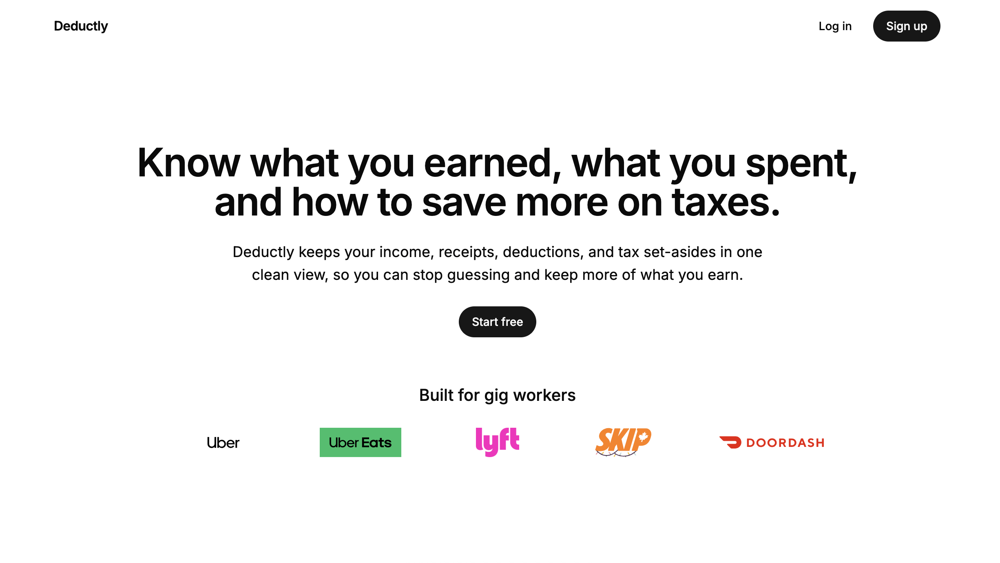

<div align="center">

# Deductly

### Expense Tracking & Tax Preparation for Gig Workers

Know what you earned, what you spent, and how to save more on taxes.



</div>

---

## Overview

Deductly is a modern expense tracking application built specifically for gig workers such as Uber, Uber Eats, DoorDash, Lyft, and SkipTheDishes drivers.

Managing receipts, tracking deductible expenses, and understanding real earnings can quickly become overwhelming. Deductly simplifies the process by organizing business expenses, receipts, income, and tax-related information in one place.

The goal is simple:

> Help gig workers keep more of what they earn.

---

## Problem

Many gig workers:

- Lose receipts throughout the year
- Don't know which expenses are tax deductible
- Have difficulty calculating their real profit
- Overpay taxes because expenses aren't properly tracked
- Spend hours organizing documents before tax season

---

## Solution

Deductly provides a clean, simple dashboard where users can:

- Track income
- Record business expenses
- Upload receipts
- Categorize deductible expenses
- Monitor business profit
- Prepare for tax season

---

## Features

### Dashboard

- Income overview
- Expense overview
- Business profit
- Financial summary

### Expense Tracking

- Fuel
- Parking
- Insurance
- Maintenance
- Car Wash
- Phone
- Meals
- Supplies
- Other

### Receipt Management

- Upload receipts
- Store receipts securely
- View receipt history

### Financial Summary

- Total Income
- Total Expenses
- Net Profit
- Tax Deductions
- Estimated Taxes

### Reports

- Monthly Summary
- Yearly Summary
- Tax-ready reports

---

## Built For

- Uber
- Uber Eats
- Lyft
- DoorDash
- SkipTheDishes
- Independent Couriers
- Gig Workers

---

## Tech Stack

### Frontend

- React
- TypeScript
- Vite
- Tailwind CSS
- shadcn/ui

### Backend

- Supabase

### Database

- PostgreSQL

### Authentication

- Supabase Auth

### Storage

- Supabase Storage

---

## Screenshots

### Landing Page


```text
docs/
    hero.png
```

---

## Project Structure

```text
src/

components/
pages/
hooks/
lib/
services/
types/
utils/
assets/
```

---

## Getting Started

Clone the repository

```bash
git clone https://github.com/yourusername/deductly.git
```

Install dependencies

```bash
npm install
```

Start development server

```bash
npm run dev
```

Build production

```bash
npm run build
```

---

## Roadmap

- [x] Authentication
- [x] Expense Tracking
- [x] Receipt Upload
- [x] Dashboard
- [x] Financial Summary

Future Plans

- Mileage Tracking
- PDF Tax Reports
- Bank Import
- CSV Import
- AI Receipt Extraction
- AI Expense Categorization
- AI Tax Insights
- Mobile App

---

## Why I Built This

As an Uber driver, I experienced firsthand how difficult it is to keep track of deductible expenses throughout the year.

Many drivers lose receipts or forget to record business expenses, resulting in missed tax deductions and unnecessary stress during tax season.

Deductly was created to solve this real-world problem with a simple and intuitive experience.

---

## Status

MVP in Progress

---

## License

MIT License
